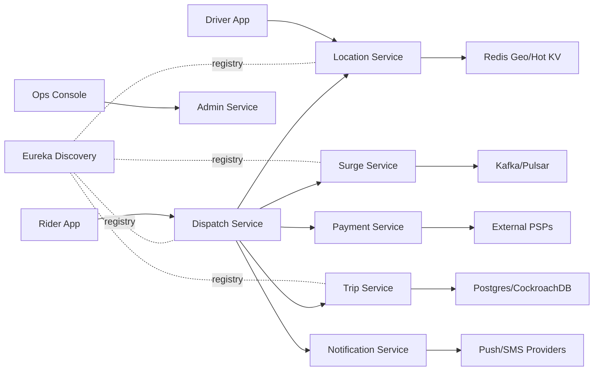
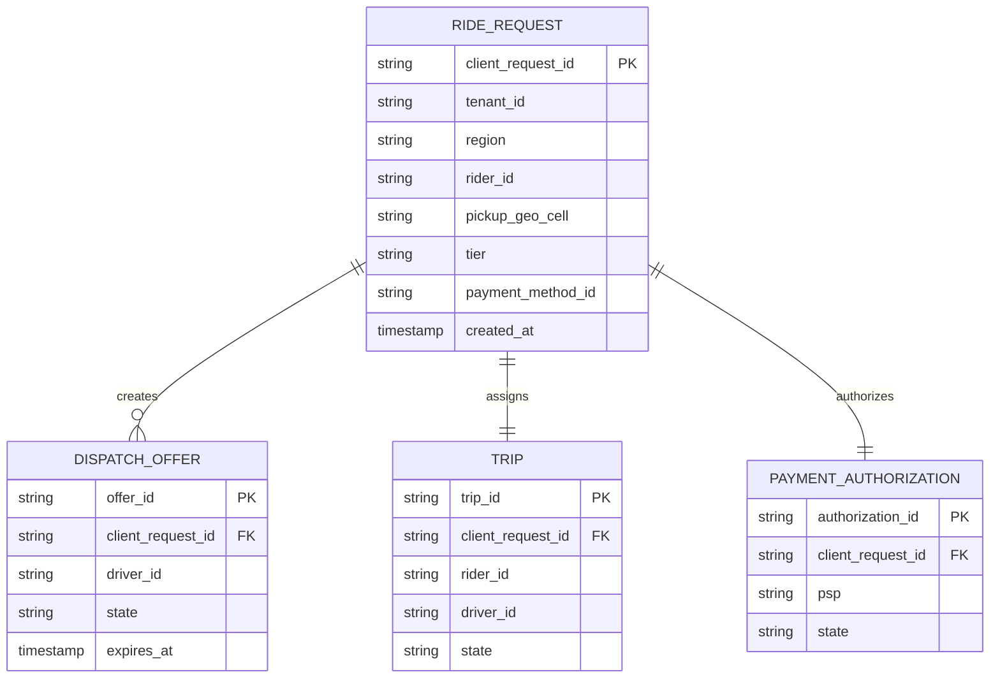

# Architecture

## HLD

The platform is split by bounded context: Dispatch, Location, Surge, Trip, Payment, Notification, Discovery, and Admin/Ops. Mobile APIs are region-local and tenant-aware. Hot-path writes stay inside the active region; cross-region replication is asynchronous for analytics, reconciliation, and disaster recovery. Services register with Spring Cloud Netflix Eureka. Public APIs use REST/JSON, while Dispatch uses gRPC/HTTP2 and protobuf contracts for low-latency internal service calls.

## Scaling

Location ingestion handles 500k updates/sec globally by sharding on `tenantId + region + geoCell` and storing latest driver state in Redis GEO or sorted sets. Dispatch scales horizontally and keeps only short-lived request context. Trip and Payment use Postgres/CockroachDB with idempotency keys and outbox events. Kafka/Pulsar topics are partitioned by tenant and region.

## Storage

Redis stores driver availability, geo-cell counters, idempotency cache, and short-lived dispatch offers. Postgres/CockroachDB stores trips, payment attempts, receipts, audit logs, and safety incidents. Kafka/Pulsar stores domain events for fanout and replay.

## LLD: Dispatch/Matching

Dispatch accepts an idempotent ride request, records demand for the pickup geo-cell over gRPC, queries nearby available drivers over gRPC, ranks by distance, gets surge multiplier, authorizes payment, creates a trip, and sends notifications. On driver decline, it excludes the previous driver and re-runs the matching logic.

Primary ranking inputs:

- Distance from pickup
- Driver availability
- Tenant and region match
- Future extensions: driver tier eligibility, acceptance score, ETA, safety score

Latency controls:

- Redis lookup for nearby drivers
- No cross-region sync on the matching hot path
- Short client timeouts to downstream services
- Idempotency key prevents duplicate ride creation

## Dispatch ERD

## Trade-offs

The sample implementation uses in-memory stores so it runs easily for review. The production design maps the same interfaces to Redis, Kafka/Pulsar, and Postgres/CockroachDB. Synchronous calls are used for the demo ride request path; production systems commonly combine synchronous dispatch decisions with event outbox publication for durable fanout.

## Extra Feature

Trip Service implements an SOS/safety incident endpoint: `POST /trips/{tripId}/sos`. In production this would page safety operations, stream a high-priority event, and attach recent driver/rider locations.
