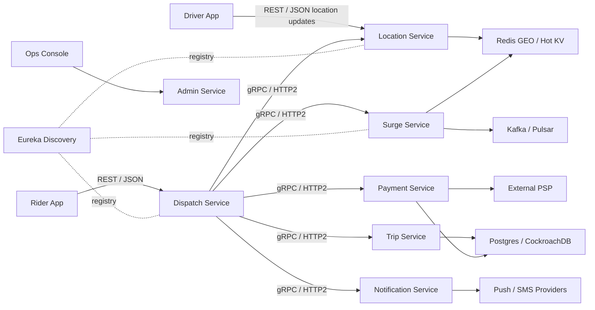
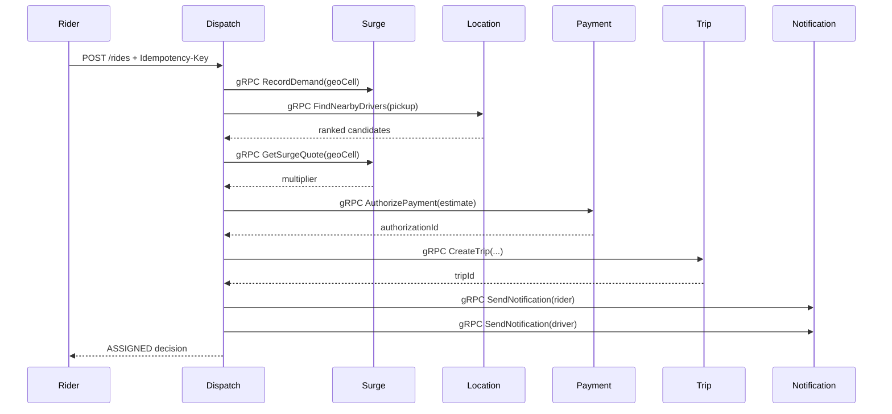
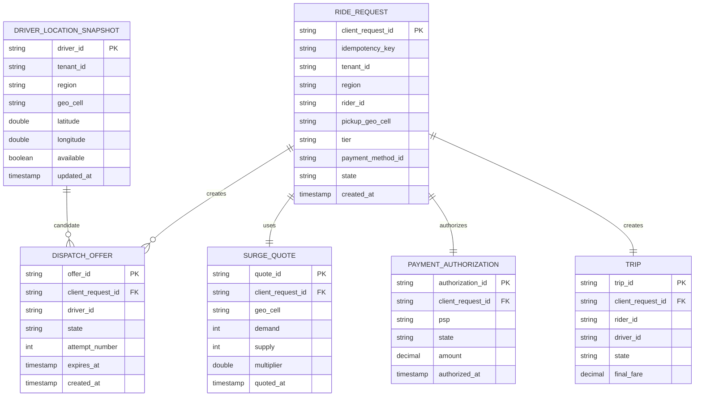

# Multi-Region Ride-Hailing Platform: Assignment Deliverables

## 1. HLD: Components, Data Flow, Scaling, Storage, Trade-offs

### Architecture Summary

The platform is a multi-tenant, multi-region ride-hailing system. Public/mobile APIs use REST/JSON for compatibility. Internal Dispatch orchestration uses gRPC over HTTP/2 with protobuf contracts for lower latency and stronger typed contracts. Kafka/Pulsar handles asynchronous events. Redis stores hot geo/location/surge state. Postgres or CockroachDB stores transactional data.

### Components

| Component | Responsibility |
| --- | --- |
| Discovery Service | Spring Cloud Netflix Eureka registry for local/service discovery |
| Dispatch Service | Ride request intake, idempotency, matching, reassignment, orchestration |
| Location Service | Driver location ingestion, latest availability, nearby driver lookup |
| Surge Service | Geo-cell demand/supply counters and multiplier calculation |
| Trip Service | Trip lifecycle: assigned, start, pause, end, fare, receipts, SOS |
| Payment Service | PSP authorization facade, retries, idempotency, reconciliation design |
| Notification Service | Push/SMS queue facade for rider/driver notifications |
| Admin Service | Feature flags and kill switches |
| Kafka/Pulsar | Durable events and fanout |
| Redis | Hot KV, geo indexes, idempotency cache, short-lived dispatch offers |
| Postgres/CockroachDB | Trips, payments, receipts, safety incidents, audit records |

### HLD Diagram



### Core Ride Request Data Flow

1. Rider calls `POST /rides` on Dispatch with pickup, destination, tier, payment method, and idempotency key.
2. Dispatch computes pickup geo-cell and records demand in Surge over gRPC.
3. Dispatch asks Location over gRPC for nearby available drivers in the same tenant and region.
4. Dispatch ranks candidates by distance and filters declined drivers.
5. Dispatch retrieves surge quote over gRPC.
6. Dispatch authorizes estimated payment over gRPC through Payment Service.
7. Dispatch creates trip over gRPC through Trip Service.
8. Dispatch sends rider and driver notifications over gRPC through Notification Service.
9. Trip lifecycle events flow asynchronously through Kafka/Pulsar for analytics, notifications, reconciliation, and support.

### Scaling Strategy

| Requirement | Scaling Design |
| --- | --- |
| 500k location updates/sec globally | Shard by `tenantId + region + geoCell`; write latest location to Redis GEO or sorted sets |
| 60k ride requests/min peak | Stateless Dispatch replicas behind regional load balancers |
| 300k concurrent drivers | Driver state stored in Redis, partitioned by region and geo-cell |
| Dispatch p95 <= 1s | gRPC internal calls, Redis hot path, no cross-region sync |
| 99.95% dispatch availability | Multi-AZ regional deployment, circuit breakers, fallback surge, graceful notification degradation |
| Multi-region | Region-local writes on hot path; async replication for analytics and DR |

### Storage Choices

| Data | Store | Reason |
| --- | --- | --- |
| Latest driver location | Redis GEO / sorted sets | Low latency, high update rate |
| Driver availability | Redis hot KV | Fast matching decisions |
| Surge counters | Redis counters + stream events | Fast per-cell aggregation |
| Trip state | Postgres/CockroachDB | Transactional lifecycle and consistency |
| Payments | Postgres/CockroachDB | Strong auditability and reconciliation |
| Events | Kafka/Pulsar | Replayable async fanout |
| Idempotency keys | Redis + DB for critical operations | Duplicate mobile request safety |

### Trade-offs

| Decision | Benefit | Trade-off |
| --- | --- | --- |
| REST for external APIs | Easy mobile/web integration, Postman-friendly | Larger payloads than protobuf |
| gRPC for internal APIs | Low latency, typed contracts, HTTP/2 multiplexing | Harder manual debugging than REST |
| Redis for location hot path | Very low latency | Needs durability strategy via event stream |
| Region-local writes | Meets latency SLO | Requires async reconciliation across regions |
| Payment isolated behind service | Shields Dispatch from PSP complexity | Payment can become pending/degraded |
| In-memory demo implementation | Easy to run locally | Production adapters needed for Redis/DB/Kafka |

## 2. LLD: Dispatch / Matching Deep Dive

### Why Dispatch/Matching

Dispatch is the most latency-sensitive part of the platform. It connects rider demand, driver location, surge pricing, payment authorization, trip creation, notifications, and reassignment logic.

### Responsibilities

- Accept idempotent ride requests.
- Compute pickup geo-cell.
- Record demand for surge.
- Fetch nearby drivers.
- Rank candidates.
- Exclude declined/timed-out drivers.
- Authorize payment.
- Create trip.
- Notify rider and driver.
- Return decision within SLO.

### Dispatch Sequence



### Matching Algorithm

Current implementation:

1. Query available drivers by tenant and region.
2. Compute haversine distance from pickup.
3. Sort by nearest distance.
4. Exclude previously declined driver IDs.
5. Assign the first candidate.

Production extensions:

- ETA model using traffic and driver heading.
- Tier eligibility.
- Driver acceptance score.
- Fraud and safety filters.
- Driver utilization balancing.
- Batched/ring-based offers with timeout.

### gRPC Internal Contract

Dispatch uses these protobuf services from `common/src/main/proto/rides.proto`:

- `LocationGrpcService.FindNearbyDrivers`
- `SurgeGrpcService.RecordDemand`
- `SurgeGrpcService.GetSurgeQuote`
- `PaymentGrpcService.AuthorizePayment`
- `TripGrpcService.CreateTrip`
- `NotificationGrpcService.SendNotification`

### Dispatch Pseudocode

```text
requestRide(request, idempotencyKey):
  return idempotencyStore.getOrCreate(idempotencyKey):
    geoCell = computeGeoCell(request.pickup)
    surge.recordDemand(geoCell)
    candidates = location.findNearbyDrivers(request.pickup)
    driver = nearest candidate not in excludedDrivers
    quote = surge.getSurgeQuote(geoCell)
    paymentAuth = payment.authorizePayment(estimate * quote.multiplier)
    trip = trip.createTrip(request, driver, quote)
    notification.send(rider)
    notification.send(driver)
    return ASSIGNED decision
```

### Latency Budget

| Step | Budget |
| --- | ---: |
| Idempotency lookup | 20 ms |
| Surge demand + quote | 80 ms |
| Location nearby lookup | 150 ms |
| Payment authorization request | 300 ms |
| Trip creation | 150 ms |
| Notifications | async / non-blocking target |
| Buffer | 300 ms |
| Total target | <= 1s p95 |

## 3. APIs & Events

### Public REST APIs

#### Driver Location Update

`PUT /locations/drivers/{driverId}`

```json
{
  "driverId": "driver-1",
  "tenantId": "ola",
  "region": "in-west",
  "latitude": 19.076,
  "longitude": 72.8777,
  "available": true
}
```

#### Ride Request

`POST /rides`

Headers:

```text
Idempotency-Key: req-1001
```

Request:

```json
{
  "clientRequestId": "ride-1001",
  "tenantId": "ola",
  "region": "in-west",
  "riderId": "rider-9",
  "pickup": {"latitude": 19.0759, "longitude": 72.8776, "label": "BKC"},
  "destination": {"latitude": 19.1197, "longitude": 72.8464, "label": "Andheri"},
  "tier": "GO",
  "paymentMethodId": "pm-card-1"
}
```

Response:

```json
{
  "rideId": "ride-1001",
  "tripId": "uuid",
  "tenantId": "ola",
  "region": "in-west",
  "riderId": "rider-9",
  "driverId": "driver-1",
  "driverDistanceKm": 0.05,
  "surgeMultiplier": 1.35,
  "authorizationId": "uuid",
  "state": "ASSIGNED",
  "decisionLatencyMs": 185
}
```

#### Driver Decline

`POST /rides/{rideId}/decline`

```json
{"driverId": "driver-1"}
```

#### Trip Lifecycle

```text
POST /trips/{tripId}/start
POST /trips/{tripId}/pause
POST /trips/{tripId}/end
POST /trips/{tripId}/sos
```

### gRPC APIs

```proto
service LocationGrpcService {
  rpc FindNearbyDrivers(NearbyDriversRequest) returns (NearbyDriversResponse);
}

service SurgeGrpcService {
  rpc RecordDemand(SurgeDemandRequest) returns (SurgeQuoteResponse);
  rpc GetSurgeQuote(SurgeQuoteRequest) returns (SurgeQuoteResponse);
}

service TripGrpcService {
  rpc CreateTrip(CreateTripGrpcRequest) returns (TripGrpcResponse);
}

service PaymentGrpcService {
  rpc AuthorizePayment(PaymentAuthorizationGrpcRequest) returns (PaymentAuthorizationGrpcResponse);
}

service NotificationGrpcService {
  rpc SendNotification(NotificationGrpcRequest) returns (NotificationGrpcResponse);
}
```

### Event Topics

| Topic | Key | Producer | Consumers |
| --- | --- | --- | --- |
| `driver.location.updated.v1` | `tenantId:region:driverId` | Location | Dispatch, Surge, Analytics |
| `ride.requested.v1` | `tenantId:region:clientRequestId` | Dispatch | Surge, Fraud, Analytics |
| `dispatch.offer.created.v1` | `tenantId:region:driverId` | Dispatch | Driver Gateway, Notification |
| `dispatch.offer.declined.v1` | `tenantId:region:driverId` | Dispatch | Dispatch, Analytics |
| `trip.state.changed.v1` | `tenantId:region:tripId` | Trip | Notification, Payment, Support |
| `payment.authorization.created.v1` | `tenantId:region:authorizationId` | Payment | Trip, Reconciliation |
| `safety.incident.opened.v1` | `tenantId:region:incidentId` | Trip | Safety Ops, Notification |

### Event Envelope

```json
{
  "eventId": "uuid",
  "topic": "trip.state.changed.v1",
  "tenantId": "ola",
  "region": "in-west",
  "occurredAt": "2026-05-22T10:00:00Z",
  "payload": {}
}
```

## 4. Data Model: Dispatch / Matching ERD



## 5. Resilience Plan

### Retries

- Mobile clients retry mutation APIs using the same idempotency key.
- Internal gRPC calls use short deadlines.
- PSP operations use bounded retries with exponential backoff and jitter.
- Kafka/Pulsar consumers use retry topics and dead-letter queues.

### Backpressure

- Location ingestion samples or drops stale non-critical updates when Redis/Kafka lag rises.
- Dispatch rejects overload with retryable `429`/`503` rather than queueing indefinitely.
- Surge counters can batch updates per geo-cell.
- Notification sending is asynchronous and does not block trip creation in production.

### Circuit Breakers

| Dependency | Circuit Breaker Behavior |
| --- | --- |
| Location | Fail fast with no-driver response or fallback to wider geo-cell |
| Surge | Default multiplier to `1.0` and emit degradation metric |
| Payment | Return payment pending/failure; never double charge |
| Trip | Do not notify driver unless trip creation succeeds |
| Notification | Queue for retry; do not fail the dispatch decision |
| PSP | Isolate with bulkhead, timeout, retry, reconciliation |

### Failure Modes

| Failure | Response |
| --- | --- |
| Duplicate ride request | Idempotency returns same dispatch decision |
| Driver declines | Re-run matching excluding declined driver |
| Driver timeout | Offer expires and Dispatch reassigns |
| PSP slow | Payment remains pending or fails cleanly; reconciliation continues |
| Region outage | Route new requests to failover region; no synchronous cross-region dependency |
| Redis shard degraded | Restrict matching to healthy cells, shed low-priority traffic |
| Kafka lag | Keep hot path alive; consumers catch up asynchronously |

### Security and Compliance

- PCI: store only PSP tokens, never raw card details.
- PII: encrypt sensitive fields at rest.
- GDPR/DPDP: support anonymization and deletion workflows.
- Audit: immutable payment, trip, and admin-operation logs.

## 6. Feature of Choice: Trip SOS / Safety Incident

### Why This Feature

Ride-hailing platforms need a first-class safety workflow. The implemented feature lets a rider or driver raise an SOS/safety incident during a trip.

### Implementation

Endpoint:

```text
POST /trips/{tripId}/sos
```

Request:

```json
{
  "reportedBy": "rider-9",
  "reason": "Unsafe driving"
}
```

Response:

```json
{
  "incidentId": "uuid",
  "tripId": "uuid",
  "tenantId": "ola",
  "reportedBy": "rider-9",
  "reason": "Unsafe driving",
  "state": "OPEN",
  "createdAt": "2026-05-22T10:00:00Z"
}
```

Production extension:

- Publish `safety.incident.opened.v1`.
- Notify safety operations.
- Attach recent rider/driver locations.
- Open support case.
- Optionally trigger emergency escalation.

## 7. Video Presentation Plan: 5-10 Minutes

### Minute-by-Minute Script

| Time | Content |
| --- | --- |
| 0:00-0:45 | Introduce problem, traffic assumptions, latency SLOs |
| 0:45-1:45 | HLD: services, REST/gRPC split, Redis, Kafka, DB, Eureka |
| 1:45-3:00 | Ride request data flow from rider request to driver notification |
| 3:00-4:30 | Dispatch/Matching LLD and why gRPC is used internally |
| 4:30-5:30 | Storage model and ERD |
| 5:30-6:45 | Resilience: idempotency, retries, circuit breakers, backpressure |
| 6:45-7:45 | Multi-region strategy and trade-offs |
| 7:45-8:30 | Feature of choice: Trip SOS/safety incident |
| 8:30-10:00 | Local demo plan and closing decisions |

### Demo Flow

1. Start Eureka.
2. Start all services.
3. Seed two driver locations.
4. Request a ride from Dispatch REST API.
5. Show Dispatch internally calling gRPC services.
6. Trigger driver decline and reassignment.
7. Start/end trip or trigger SOS.
8. Show docs and protobuf contract.
